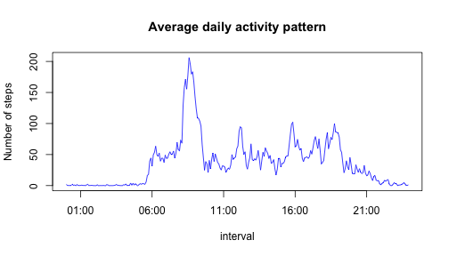
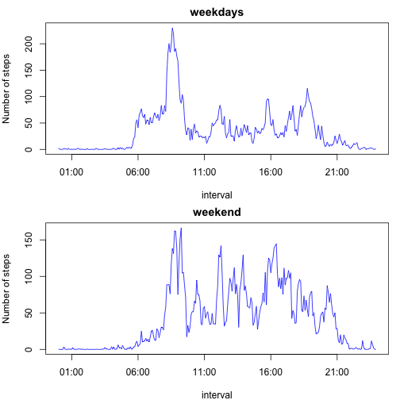

RepData_Assignment1
========================================================
## set global options

```r
opts_chunk$set(echo = TRUE)
```

## Loading and preprocessing the data


```r
data <- read.csv("activity.csv", header = TRUE, sep = ",")
data$date_revised <- as.Date(data$date)
data$interval_revised <- sprintf("%04d", data$interval)
data$interval_time <- strptime(data$interval_revised, format = "%H%M")
```


## Calculate mean total number of steps per day

```r
s_date <- split(data, data$date_revised)
total_steps <- sapply(s_date, function(x) sum(x$steps, na.rm = TRUE))
```


### 1. histogram for total number of steps taken each day

```r
plot <- hist(total_steps, main = "Total steps per day", xlab = "total number of steps taken each day")
```

 


### 2. Calculate mean and median total number of steps taken per day

```r
mean_steps <- mean(total_steps)
median_steps <- median(total_steps)
mean_steps
```

```
## [1] 9354
```

```r
median_steps
```

```
## [1] 10395
```


## Average daily activity pattern

### 1. Plot for average daily activity pattern

```r
s_pattern <- split(data, data$interval_revised)
average_steps <- sapply(s_pattern, function(x) mean(x$steps, na.rm = TRUE))
plot(data$interval_time[1:288], average_steps, type = "l", col = "blue", main = "Average daily activity pattern", 
    xlab = "interval", ylab = "Number of steps")
```

 


### 2. Get the most active 5-minute interval

```r
max_index <- which(average_steps == max(average_steps))
max_interval <- data$interval_revised[max_index]
max_interval
```

```
## [1] "0835"
```

*the 5-minute interval 0835, on average across all the days in the dataset, contains the maximum number of steps.*


## Imputing missing valuse

### 1. Calculate and report total number of missing values in the dataset. 

```r
bad <- is.na(data$steps)
num_NA <- length(data$steps[bad])
num_NA
```

```
## [1] 2304
```

*the total number of missing values in the dataset is 2304.*

### 2. Fill all the missing value by the mean for that 5-minute interval

```r
data$average_steps <- average_steps
for (i in seq(nrow(data))) {
    if (is.na(data[i, "steps"])) {
        data$steps_revised[i] <- data[i, "average_steps"]
    } else {
        data$steps_revised[i] <- data[i, "steps"]
    }
}
```


### 3. Create a new dataset with missing data filled in. 

```r
data_revised <- data.frame(steps = data$steps_revised, date = data$date, interval = data$interval)
head(data_revised)
```

```
##     steps       date interval
## 1 1.71698 2012-10-01        0
## 2 0.33962 2012-10-01        5
## 3 0.13208 2012-10-01       10
## 4 0.15094 2012-10-01       15
## 5 0.07547 2012-10-01       20
## 6 2.09434 2012-10-01       25
```


### 4. Make a plot steps taken each day, with missing value filled in,

```r
s_date_revised <- split(data, data$date_revised)
total_steps_revised <- sapply(s_date_revised, function(x) sum(x$steps_revised, 
    na.rm = TRUE))
plot <- hist(total_steps_revised, main = "Total steps per day_revised", xlab = "total number of steps taken each day_revised")
```

 


### Calculate mean and median total number of steps taken per day. 

```r
mean_steps <- mean(total_steps_revised)
median_steps <- median(total_steps_revised)
mean_steps
```

```
## [1] 10766
```

```r
median_steps
```

```
## [1] 10766
```

*These value differ from the estomate from the first part of the assignment. After we filled in the missing value with the mean steps for that 5-minute interval, the mean and median steps taken per day has increased.*

## Difference in activity patterns between weekdays and weekends?
### 1.Create a new factor variable indicating weekday or weekend

```r
library(timeDate)
data$day_type <- "weekdays"
data$day_type[isWeekend(data$date_revised)] <- "weekend"
data$day_type <- as.factor(data$day_type)
```


### 2.plot for average daily activity pattern(Weekdays & Weekend)

```r
# seperate the weekdays and weekend data into two groups
s_dayType <- split(data, data$day_type)
s_pattern <- lapply(s_dayType, function(x) split(x, x$interval_revised))
data_weekdays <- s_pattern[["weekdays"]]
data_weekend <- s_pattern[["weekend"]]

# calculate the weekdays and weekend's average steps for each 5-minutes
# interval.
average_steps_weekdays <- sapply(data_weekdays, function(x) mean(x$steps_revised))
average_steps_weekend <- sapply(data_weekend, function(x) mean(x$steps_revised))

# plot the average 5-minutes interval.
par(mfrow = c(2, 1), mar = c(4, 4, 2, 1))
plot(data$interval_time[1:288], average_steps_weekdays, type = "l", col = "blue", 
    main = "weekdays", xlab = "interval", ylab = "Number of steps")
plot(data$interval_time[1:288], average_steps_weekend, type = "l", col = "blue", 
    main = "weekend", xlab = "interval", ylab = "Number of steps")
```

 


